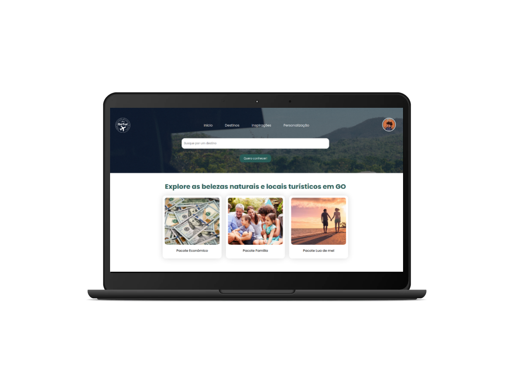

<h1 align="center">
  
</h1>

<p align="center">
  

 
</p>




## 💻 Projeto
GoTur é perfeito para quem quer agendar viagens no Estado de Goiás, ele oferece diversos pacotes que o usuário final pode escolher para viagem, como familiar, luxo e aventura, tecnológica, de uma forma muito organizada e democrática. 

Este é um projeto desenvolvido durante o hackathon Reboot The World, organizado pela **[Shawee](https://shawee.io/pt/)**, apresentado dos dias 16 a 24 de Julho de 2021.


## ✨ Tecnologias

- 
- 
- 
- 
- 
- 

## 🚀 Executando o projeto


Clone o projeto e acesse o diretório onde foi criado.

```bash
$ git clone https://github.com/ericknathan/GoTur.git
$ cd GoTur
```

Utilize o **yarn install** ou o **npm install** para instalar as dependências do projeto.
Em seguida, inicie o projeto.

```bash
yarn start
```

Lembre-se de criar o seu App no Firebase para obter as credencias do Banco de Dados e Autenticação. Em seguida, defina no arquivo .env as configurações do seu App (remova o example do arquivo .env.example e adicione .local).
 
 ```cl
REACT_APP_API_KEY=
REACT_APP_AUTH_DOMAIN=
REACT_APP_DATABASE_URL=
REACT_APP_PROJECT_ID=
REACT_APP_STORAGE_BUCKET=
REACT_APP_MESSAGING_SENDER_ID=
REACT_APP_APP_ID=
```

Também será necessário seguir os padrões do projeto, para isso basta importar o arquivo [database_template.json](database_template.json) no Realtime Firebase.

O app estará disponível para acesso em seu navegador em http://localhost:3000.

Lembrando que será necessário criar uma conta no [Firebase](https://firebase.google.com/) e um projeto para disponibilizar um Realtime Database e Authtentication.

## 📄 Licença

Esse projeto está sob a licença MIT. Veja o arquivo [LICENSE](LICENSE) para mais detalhes.

<br />